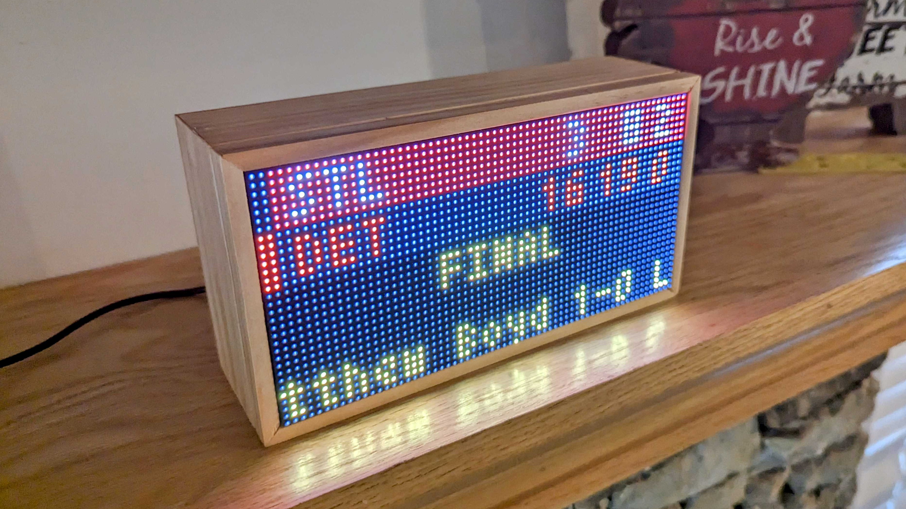

# BART LED Departure Board


<a href="assets/img/header.jpg">
  
</a>

---------------
> [!NOTE]  
> This project is a conversion from the MLB-LED-Scoreboard project to display BART station departure information.
---------------

An LED departure board for BART (Bay Area Rapid Transit) stations. Displays live departure information for your selected station.

Requires a Raspberry Pi and an LED board hooked up via the GPIO pins.

**Currently supported boards:**
 * 32x32 (Limited features)
 * 64x32 (the _most_ supported)
 * 64x64
 * 128x32
 * 128x64

If you'd like to see support for another set of board dimensions, or have design suggestions for an existing one, file an issue!

**Pi's with known issues**
 * Raspberry Pi Zero has had numerous reports of slowness and unreliability during installation and running the software.

## Table of Contents
* [Features](#features)
  * [Live Departures](#live-departures)
  * [Station Information](#station-information)
  * [System Status](#system-status)
* [Installation](#installation)
  * [Hardware Assembly](#hardware-assembly)
  * [Software Installation](#software-installation)
* [Usage](#usage)
  * [Configuration](#configuration)
  * [Flags](#flags)
* [Personalization](#personalization)
  * [Custom Board Layout](#custom-board-layout)
  * [Custom Colors](#custom-colors)
* [Sources](#sources)
  * [Accuracy Disclaimer](#accuracy-disclaimer)
* [Help and Contributing](#help-and-contributing)
* [Licensing](#licensing)

## Features

### Live Departures
Displays real-time departure information for your selected BART station, including train destinations, minutes until arrival, and line colors.

### Station Information
Shows station details including name, current time, and any special notices or alerts.

### System Status
Displays system-wide alerts and service advisories that might affect your commute.

## Installation
### Hardware Assembly
[See the wiki page for step-by-step guide.] This README is primarily focused on the BART software, but for those coming here from Reddit or elsewhere never having built things with a Raspberry Pi, this should help get you going.

A sample bill of materials (BOM) is located [here](https://www.adafruit.com/wishlists/527606)

### Software Installation
#### Requirements
You need Git for cloning this repo and PIP for installing the scoreboard software.
```
sudo apt-get update
sudo apt-get install git python3-pip
```

#### Installing the departure board software
This installation process will take about 10-15 minutes. Raspberry Pis aren't the fastest of computers, so be patient!

```
git clone https://github.com/yourusername/BARTDepartureBoard.git
cd BARTDepartureBoard/
sudo ./install.sh
```

This will create a Python Virtual Environment and install all of the required dependencies. The
virtual environment will be located at `BARTDepartureBoard/venv/`.

This will install the rgbmatrix binaries, which we get from [another open source library](https://github.com/hzeller/rpi-rgb-led-matrix/tree/master/bindings/python#building). It controls the actual rendering of the departure board onto the LEDs. If you're curious, you can read through their documentation on how all of the lower level stuff works.

It will also install the following python libraries that are required for certain parts of the board to function:

* [tzlocal](https://github.com/regebro/tzlocal): Timezone libraries. These allow the board to convert times to your local timezone
* [requests](https://pypi.org/project/requests/): Used to fetch data from the BART API.
* [RGBMatrixEmulator](https://github.com/ty-porter/RGBMatrixEmulator): The emulation library for the matrix display. Useful for running on MacOS or Linux, or for development.

#### Updating
* Run `git pull` in your BARTDepartureBoard folder to fetch the latest changes. A lot of the time, this will be enough, but if something seems broken:
    * **Re-run the install file**. Run `sudo ./install.sh` again. Any additional dependencies that were added with the update will be installed this way.
    * **Check your custom layout/color files if you made any**. There's a good chance some new keys were added to the layout and color files. These changes should just merge right in with the customized .json file you have but you might want to look at the new .json.example files.

#### Time Zones
Make sure your Raspberry Pi's timezone is configured to your local time zone. For BART, setting it to America/Los_Angeles is recommended. You can change the timezone of your raspberry pi by running `sudo raspi-config`.

## Usage
The installation script adds a line to the top of `main.py` to automatically pick up the virtual environment.
This means re-activating the environment (`source ./venv/bin/activate`) is not a requirement.

`sudo ./main.py` Running as root is 100% an absolute must, or the matrix won't render.

**Adafruit HAT/Bonnet users: You must supply a command line flag:**

`sudo ./main.py --led-gpio-mapping="adafruit-hat"`

See the Flags section below for more flags you can optionally provide.

### Running on Other Platforms

The board can run on other platforms by means of software emulation via `RGBMatrixEmulator`. When running via the emulator, you do not need to prepend your startup commands with `sudo`:

```sh
./main.py
```

You can also force the board into emulation mode by using the `--emulated` flag:

```sh
./main.py --emulated
```

When running in emulation mode, you can continue to use your existing command line flags as normal.

See [RGBMatrixEmulator](https://github.com/ty-porter/RGBMatrixEmulator) for emulator configuration options.

### Configuration

A default `config.json.example` file is included for reference. Copy this file to `config.json` and modify the values as needed.

```
"preferred":                        Options for station preferences
  "stations"               Array    An array of preferred stations. The first station in the list will be used as your 'home' station. Example: ["Powell St", "Embarcadero"]
  "lines"                  Array    An array of preferred lines that you're interested in. Example: ["Red", "Yellow", "Blue"]

"rotation":                         Options for rotation through different stations
  "enabled"               Bool     Rotate through each station according to the configured `rates`.
  "scroll_until_finished"  Bool     If scrolling text takes longer than the rotation rate, wait to rotate until scrolling is done.
  "only_preferred"         Bool     Only rotate through stations in your preferred stations.
  "rates"                  Dict     Dictionary of Floats. Each type of screen can use a different rotation rate.

"time_format"              String   Sets the preferred hour format for displaying time. Accepted values are "12h" or "24h".
"scrolling_speed"          Integer  Sets how fast the scrolling text scrolls. Supports an integer between 0 and 6.
"debug"                    Bool     Debug data is written to your console.
```

### Flags

You can configure your LED matrix with the same flags used in the [rpi-rgb-led-matrix](https://github.com/hzeller/rpi-rgb-led-matrix) library. More information on these arguments can be found in the library documentation.
```
--led-rows                Display rows. 16 for 16x32, 32 for 32x32. (Default: 32)
--led-cols                Panel columns. Typically 32 or 64. (Default: 32)
--led-chain               Daisy-chained boards. (Default: 1)
--led-parallel            For Plus-models or RPi2: parallel chains. 1..3. (Default: 1)
--led-pwm-bits            Bits used for PWM. Range 1..11. (Default: 11)
--led-brightness          Sets brightness level. Range: 1..100. (Default: 100)
--led-gpio-mapping        Hardware Mapping: regular, adafruit-hat, adafruit-hat-pwm
--led-scan-mode           Progressive or interlaced scan. 0 = Progressive, 1 = Interlaced. (Default: 1)
--led-pwm-lsb-nanosecond  Base time-unit for the on-time in the lowest significant bit in nanoseconds. (Default: 130)
--led-show-refresh        Shows the current refresh rate of the LED panel.
--led-slowdown-gpio       Slow down writing to GPIO. Range: 0..4. (Default: 1)
--led-no-hardware-pulse   Don't use hardware pin-pulse generation.
--led-rgb-sequence        Switch if your matrix has led colors swapped. (Default: RGB)
--led-pixel-mapper        Apply pixel mappers. e.g Rotate:90, U-mapper
--led-row-addr-type       0 = default; 1 = AB-addressed panels. (Default: 0)
--led-multiplexing        Multiplexing type: 0 = direct; 1 = strip; 2 = checker; 3 = spiral; 4 = Z-strip; 5 = ZnMirrorZStripe; 6 = coreman; 7 = Kaler2Scan; 8 = ZStripeUneven. (Default: 0)
--led-limit-refresh       Limit refresh rate to this frequency in Hz. Useful to keep a constant refresh rate on loaded system. 0=no limit. Default: 0
--led-pwm-dither-bits     Time dithering of lower bits (Default: 0)
--config                  Specify a configuration file name other, omitting json xtn (Default: config)
--emulated                Force the board to run in software emulation mode.
--drop-privileges         Force the matrix driver to drop root privileges after setup. (Default: true)
```

## Personalization
If you're feeling adventurous (and we highly encourage it!), the sections below outline how you can truly personalize your departure board and make it your own!

### Custom Board Layout
You have the ability to customize the way things are placed on the board. See the `coordinates/` directory for more information.

### Custom Colors
You have the ability to customize the colors of everything on the board. See the `colors/` directory for more information.

## Sources
This project uses the [BART GTFS Realtime API](https://bart.gov/schedules/developers/gtfs-realtime) for retrieving live departure data.
The [rpi-rgb-led-matrix](https://github.com/hzeller/rpi-rgb-led-matrix) library is used for making everything work with the LED board.

### Accuracy Disclaimer
The departure board updates frequently, but it cannot retrieve information that BART has not yet made available. If something is odd or it seems behind, the first suspect is the BART API.

## Help and Contributing
If you run into any issues and have steps to reproduce, open an issue. If you have a feature request, open an issue. If you want to contribute a small to medium sized change, open a pull request. If you want to contribute a new feature, open an issue first before opening a PR.

## Licensing
This project uses the GNU Public License. If you intend to sell these, the code must remain open source.
